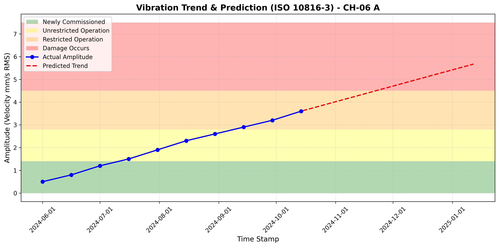

# 📊 ISO 10816-3 Vibration Trend Analysis

โปรเจกต์นี้ใช้สำหรับวิเคราะห์แนวโน้มความเสียหายของเครื่องจักรหมุน (Rotating Machinery) โดยอ้างอิงเกณฑ์ความสั่นสะเทือนตามมาตรฐาน **ISO 10816-3** พร้อมฟังก์ชันพยากรณ์ล่วงหน้า (Predictive Forecasting) เพื่อคาดการณ์วันที่เครื่องจักรอาจเข้าสู่โซนอันตราย

## 📝 ฟีเจอร์หลัก
- อ่านข้อมูลจากไฟล์ที่มีคอลัมน์ `Time stamp` และ `Amplitude`
- แบ่งโซนสีความรุนแรงตามมาตรฐาน ISO 10816-3 (เขียว, เหลือง, ส้ม, แดง)
- ใช้ Linear Regression ทำนายแนวโน้มล่วงหน้า 90 วัน
- ส่งออกผลลัพธ์เป็น **ไฟล์ภาพความละเอียดสูง (.png)** โดยอัตโนมัติ

## ⚙️ วิธีการติดตั้ง (สำหรับ VS Code)

1. **สร้าง Virtual Environment (venv):**
   เปิด Terminal ใน VS Code แล้วพิมพ์คำสั่ง:
   ```bash
   python -m venv venv

2. **เปิดใช้งาน venv**

Windows: .\venv\Scripts\activate


3. **ติดตั้งไลบรารีที่จำเป็น**

pip install -r requirements.txt


**🚀 วิธีการใช้งาน**
นำไฟล์ข้อมูลของคุณ (เช่น A_CH-06 A_NAA_1490__Jun24.txt) มาวางในโฟลเดอร์เดียวกับโค้ด
(ตรวจสอบให้แน่ใจว่าไฟล์มีหัวคอลัมน์ชื่อ Time stamp และ Amplitude)

แก้ไขชื่อไฟล์ในส่วนท้ายของไฟล์ vibration_analysis.py ให้ตรงกับไฟล์ของคุณ

**รันสคริปต์ด้วยคำสั่ง**
python vibration_analysis.py

ตรวจสอบผลลัพธ์: จะมีไฟล์ภาพชื่อ sample_data.png ปรากฏขึ้นในโฟลเดอร์ของคุณ




Developed by: 65160401 นายภูวเนตร เกิดเนตร
